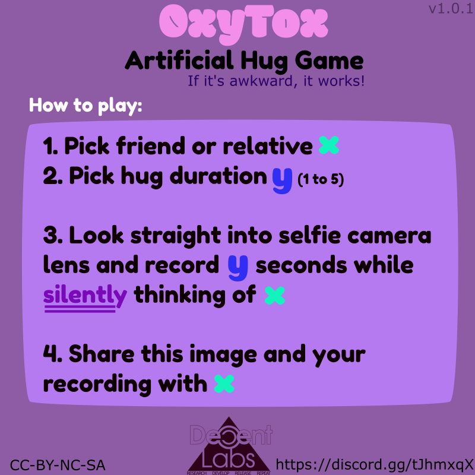

# oxytox

> Artificial hugs for everyone

In our nonrelenting fight against long term depression,
we propose to inject a decentralized hug virus into the meme-stream.

**Expected outcome:**
- stimulate social function
- maintain relations
- induce mutual oxytocin release
- mitigate negative effects of social distancing

### The Game

### Additional guidelines/observations

- First time players should pick someone they've shared a hug with IRL.
- no words! (Words can hurt while faces seldom lie and so on.. wordless humming is fine! :>).
- avoid retakes, try to send before watching it yourself.
- don't be dissapointed if you don't get a reply. Giving a hug is half the effort.
- The feeling of awkwardness increases with higher durations, but so does the social stimuli.
