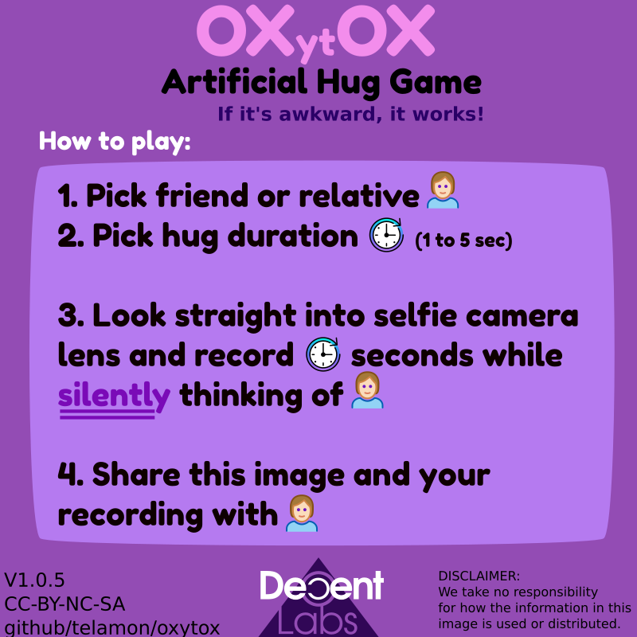

# oxytox - Artificial hugs for everyone

> Experimental social p2p meta-game of trust

In our nonrelenting fight against long term depression,
we propose to inject a decentralized hug virus into the meme-stream.

**Expected outcome:**

- stimulate social function
- Oxytocin &amp; Dopamine loop hack
- maintain relations
- mitigate negative effects of social distancing

> **Update 2021** In order to receive long-term positive effects
> make a minimum of 4 weekly pacts with people that are important to you.
> Together agree on a weekday and do a trial run for 2 months
> exchanging oxytoxies once a week. (It's only gonna cost both of you minimum 8 seconds of your life).
> If you enjoy it, then become best peers forever 👌
>
> An expansion pack is in the works, check back
> once a week.

The most influental reference for this game is:
[The Evolution of Trust](https://ncase.me/trust/)
Try it out, and pretend that each exchange is an oxytox instead of a coin.

## Quickstart / Walkthru

Start a new game by sharing the image below to a friend via some sort of private message (telegram/discord/fbmessgener, whichever you prefer).

Then follow up with:

**a)** Question "Wanna play?" and await response: if yes then proceed else abort

**b)** If you are brave and guerilla-hugs are appropriate within the boundaries of your relation then send your recording directly.

(Just don't forget to send the rules/image first or things will get more awkward
than necessary.🤦)

After you've sent the rules and recording enter radio-silence (upto 2 hours), trust your co-player to figure whats expected of them without further hints.
(It is very natural to humans to mimic each other's behaviour.)

Once you've received their recording, rewatch both recordings starting with yours then theirs, then exit radio-silence.

You should now both be experiencing a mutual euphoric rush that can be observed as a temporary increase in message activity. Feel free to discuss the experience with each other. Enjoy 😉


**First time players:**
- X: pick someone you've shared a _real_ hug with before.
- Y: 2-3s is a good value.

## The Game

[Direct link](https://github.com/telamon/oxytox/raw/master/oxytox-v1.0.5.png)



### Additional guidelines/observations

- **NO WORDS!** (Words can hurt while silence cannot lie and so on.. wordless humming is fine! :>).
- Smile if you feel like it 🙂
- Show your current state. _but put on some clothes if necessary_
- avoid retakes, try to send before watching it yourself.
- don't reuse recordings, each is personal and unique.
- don't forward personal recordings, it's not nice and damages relations.
- If you don't get a reply dont despair, accepting a hug can sometimes take more courage than giving one. Send another to someone else! 👍
- The feeling of awkwardness increases with higher durations, and to some degree the social stimuli.
- 1 hug a day keeps sighs at bay.
- tested with discord & telegram 👌

[Feedback &amp; rule suggestions are welcome](https://github.com/telamon/oxytox/issues/new)

## Development

Made with Inkscape
and the following fonts:

- https://fonts.google.com/specimen/Fredoka+One
- https://fonts.google.com/specimen/Coiny
- https://fonts.google.com/specimen/Modak

## Credits

```ad
 _____                      _   _           _
|  __ \   Help Wanted!     | | | |         | |
| |  | | ___  ___ ___ _ __ | |_| |     __ _| |__  ___   ___  ___
| |  | |/ _ \/ __/ _ \ '_ \| __| |    / _` | '_ \/ __| / __|/ _ \
| |__| |  __/ (_|  __/ | | | |_| |___| (_| | |_) \__ \_\__ \  __/
|_____/ \___|\___\___|_| |_|\__|______\__,_|_.__/|___(_)___/\___|

If you're reading this it means that the docs are missing or in a bad state.

Writing and maintaining friendly and useful documentation takes
effort and time. In order to do faster releases
I will from now on provide documentation relational to project activity.

  __How_to_Help____________________________________.
 |                                                 |
 |  - Open an issue if you have ANY questions! :)  |
 |  - Star this repo if you found it interesting   |
 |  - Fork off & help document <3                  |
 |.________________________________________________|

I publish all of my work as Libre software and will continue to do so,
drop me a penny at Patreon to help fund experiments like these.

Patreon: https://www.patreon.com/decentlabs
Discord: https://discord.gg/tJhmxqX
```

2020 &#x1f12f; Tony Ivanov
